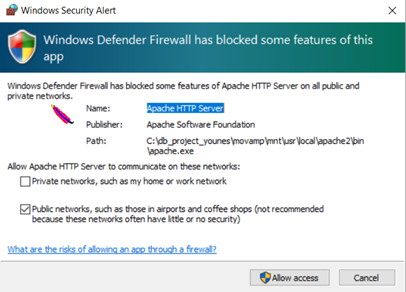
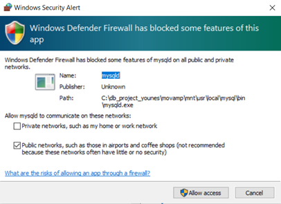
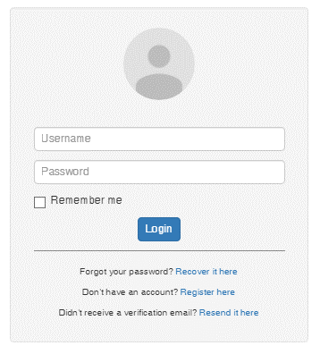
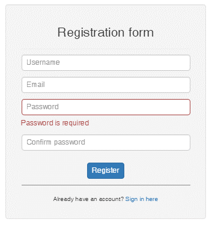
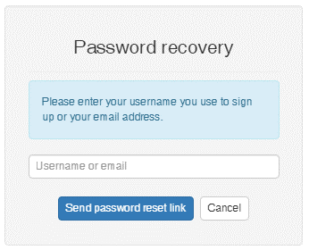

# OnlineBookstore
This application lets users browse a collection of books that are available in the bookstore. A user can search the bookstore by book name, author name, ISBN, genre, etc..

# Installation environment
unzip MOVAMP (movamp.zip) on your local drive, you will find the following: 
-	mnt folder
-	movamp application  (double click once on the icon)

You will see two screens, one for the Apache HTTP server and one for the SQL server (as follows). Click on “Allow Access” for both.

### Click on "Allow Access" on the Apache HTTP Server Dialog


### Click on "Allow Access" on the mysql Server Dialog


# Database Creation on phpMyAdmin

## Step 1: Running phpMyAdmin
1.	Open a web browser such as Chrome
1.	Type the URL: http://localhost/phpmyadmin to open the PHPMYADMIN application:
1.  Use the following credentials and then click on GO
-	Username: root
-	Password: (empty)

## Step 2: DB creation and import of the DB Schema on phpMyAdmin
1. Create a new database named **bookstore** (choose utf8_unicode_ci)
1. Go to the tab _Import_ and choose a file that contains the database DDL and click on the button (Go) (**DDL.sql**). 
1. Go to the tab _Import_ and choose a file that contains the database data and click on the button (Go) ( **Data.sql**).

- Now we have 15 tables installed on the MySQL server.


## Step 3: Make sure that your application is uploaded on the movamp folder
1. go to **movamp\mnt\var\www** folder. Check the bookstore folder. It should have all php files
2. Open the file **phpgen_settings.php**
3. Go to the line 21 and configure a database parameters as follows:
```php
function GetGlobalConnectionOptions()
{
    return
        array(
          'server' => 'localhost',
          'port' => '3306',
          'username' => 'root',
          'database' => 'bookstore',
          'client_encoding' => 'utf8'
        );
}

```
# Running the Online Bookstrore application
Now after installation of the database and the web application on the server, the next step is running the application on the web  browser with the URL : **http://localhost/bookstore**

To access to the application login with the username and password. We have 3 roles:
1. Admin: (uid: _admin_;  pwd:_admin_)
2. Owner: (uid: _ownwe_;  pwd:_owner_)
3. User:  (uid: _user1_;  pwd:_user1_)

### Login dialog 
The following Login dialog is shown:



### Creation of a new account: 
The following Registration dialog is shown when you click on _"Register Here"_ (on the above dialog for new accounts):



### Password Recovery:
If you would like recover the password you must click on the link below the login form.



## Managing the Bookstore through the _OWNER_ account

If you log in with the owner user id and password, you will be able to manage the bookstore, books, users, accounts, etc.


